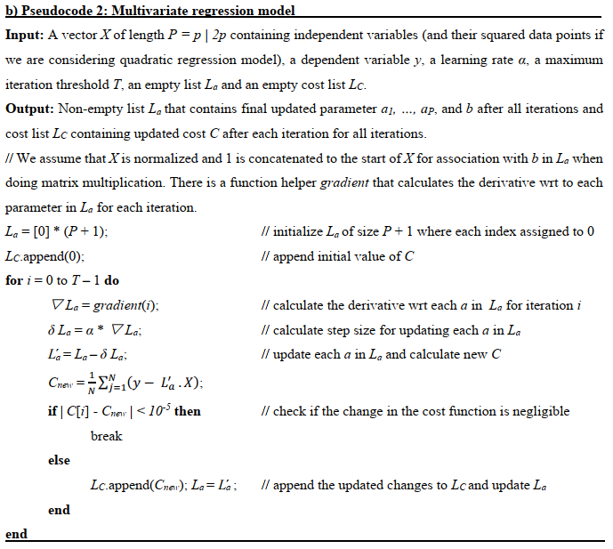

# DataMining-Regression
Design and implement a gradient descent algorithm for univariate and multivariate regression.

# Compilation
Use `pip install -r requirements.txt` to install the required packages used in this project.

Then run `python main.py`.

# Concrete Compressive Strength Dataset
The actual concrete compressive strength (MPa) for a given mixture under a specific age (days) was determined from laboratory.
There are 8 input variables (features) and one output variable (target). 

There are 1030 samples in this dataset; for this assignment, the first 900 instances are used for training while the last 130 are used for testing.

# Gradient Descent Algorithm
We define our cost function to be Mean Square Error. Whether we are doing univariate or multivariate regression, the procedure of Gradient Descent algorithm is essentially the same.

For each iteration within the maximum number of iterations

1. Calculate the derivative (gradient) with respect to each parameter defined (for univariate model this is param m and bias b while for multivariate model this is param a0, ..., ap where a0 is bias b and p is number of input variables).
2. Calculate the step size for each gradient to descent by
3. Calculate new parameters and cost function to check if the change in the cost function is considered negligible (second condition for stopping point in case the model finds the best parameters before reaching maximum number of iterations).
4. If the model does not meet the convergence check in step 3, we update the parameters for the next iteration. Otherwise, the parameters we have received from the latest iteration meet the check and become the model's final learned parameters.

### Pseudocode for univariate regression model using Gradient Descent

### Pseudocode for multivariate regression model using Gradient Descent

# Results
The plots below show univariate regression model (with learning rate 0.1 and max iteration 100) applied individual feature for training data

Cement, Blast Furnace Slag, Superplasticizer, and Age are four main factors that represent concrete compressive strength.
According to the plot shown above, when going through univariate model individually, the learned parameters for these features generate a positive correlation between each feature and the target variable.

Out of the four, Cement shows the highest correlation with the concrete compressive strength. 
This also matches our normal intuition. When we talk about concrete, a lot of the time we will be thinking about cement because it is an essential component in creating concrete.

Additionally, we look at the learned parameters from all models (eight univariate models for each feature and two multivariate models for all features).
There are correlations between the parameters learned for a feature in its univariate model and those for the corresponding feature in the multivariate models.
The multivariate models also confirm that the four features above certainly hold more significance than the remaining features.

For a more comprehensive view of the assignment, please consider looking at the report also included in this repository.

# References

https://archive.ics.uci.edu/ml/datasets/Concrete+Compressive+Strength

https://www.youtube.com/watch?v=sDv4f4s2SB8 (Gradient Descent step-by-step by Josh Starmer)

https://en.wikipedia.org/wiki/Linear_regression

https://becominghuman.ai/univariate-linear-regression-with-mathematics-in-python-8ebac73f9b12